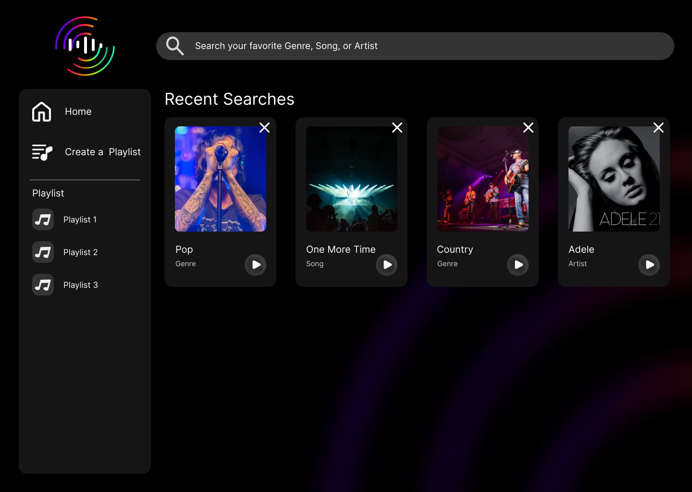

# Playlist-Creator
## project description
playlist creation and generation, search based on genre, artist, song, etc

## Rules
- Main branch is protected
- PRs for everyone
- 1 reviewer per PR

## project manager & tasks
- Brady project manager
- Brady JS
- Marjan UI
- Quincy HTML, CSS and JS as needed

## project title
Minimum Viable Playlist

## project description
A simple and sleek playlist creation app

## user story
- as a music enthusiast, I want to easily make playlists  

## Acceptance Criteria
### an app that can fetch music with 2-3 filters and create playlists
- given a playlist creation site, when I search for music, then I find songs, albums, artists relevant to the input
- given the music search results, when I look through the results, then I can filter them based on 2-3 different criteria
- given the search results, when I select a song, then I can add it to a playlist
- given a collection of playlists, when I click on a playlist, then I am taken to a page with the complete list

## Additional Criteria (if there is time)
- add soundcloud widget for playing songs
- pinning/favoriting feature for songs/playlists
- accordion out rest of songs in playlist cards
- add parental guidance feature
- additional APIs for more song options
- find lyrics for songs

## wireframe or sketch of design

## APIs used
- deezer
- last.fm

## Technologies used
    .svg)      .svg)

## Deployed link
https://bradylange1.github.io/Playlist-Creator/
